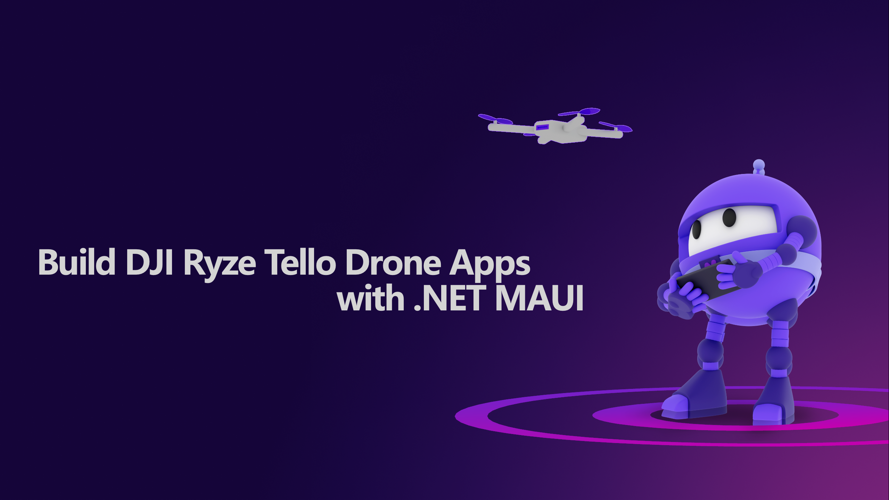

# **Build DJI Ryze Tello Drone Application with .NET MAUI**

Hi, do you use .NET MAUI for application development? With .NET, you can build multi-scenario applications, including traditional desktop applications, cloud-native applications, mobile applications, games, machine learning, IoT, big data, etc. .NET MAUI allows you to quickly build cross-platform applications through C#, and build iOS / Android / Windows / macOS applications. This series combines DJI Ryze Tello to quickly build an interactive application with drones, hoping to become your begninning course for .NET MAUI.

本次系列提供中文内容，请访问 <a href="./README.zh_cn.md">用 .NET MAUI 构建 DJI Ryze Tello 无人机应用</a>

### **You can learn**

1. C# UDP programming
2. Build a DJI Ryze Tello Prototype Using the .NET Polyglot Notebooks Interactive Tool
3. Knowledge about mobile applications develpment
4. Knowledge of .NET MAUI 
5. Build UI with .NET MAUI Comet
6. .NET MAUI binding native library for mobile applications

### **Scenario**

Drones are very popular equipment. In addition to being used for aerial photography, drones can directly assist different industries to complete specific tasks, such as agriculture, wind power equipment maintenance, and STEM education. This series is based on DJI Ryze Tello to complete the construction of related applications.

**DJI Ryze Tello**

    

The DJI Ryze Tello is a small drone with an onboard camera capable of taking 5MP photos and streaming 720p HD video. It's a lightweight and affordable quadcopter that's great for indoor flying and perfect for beginners. Developers can link to DJI Ryze Tello through the UDP protocol, control DJI Ryze Tello by sending different commands (takeoff and landing, fancy flight, etc.), and can transmit images from the camera of DJI Ryze Tello in real time through UDP.

You can buy DJI Ryze Tello through DJI Store https://store.dji.com/shop/tello-series

**Information**

This series hopes to build an iOS and Android application to control DJI Ryze Tello through C#, and can obtain the image transmission of DJI Ryze Tello in real time

You can learn related content in the following order

| Learning topics | Related content | Link |
| ----------- | ----------- | ----------- |
| Environment configuration | Development environment building skills, including the installation of .NET MAUI,  configuration of development tools and the conditions to be prepared for application development based on iOS / Android | Link
| C# UDP programming | Learn C# UDP programming, and connect to DJI Ryze Tello through Notebooks,  Complete the construction of prototype development | <a href="./cn/01.UDPwithCSharp.md">Link</a>
| Learning of .NET MAUI | Learn about .NET MAUI, including iOS / Android development | <a href="./cn/02.dotNETMAUIIntro.md">Link</a>
| .NET MAUI Comet UI to build application UI | Learn about .NET MAUI Comet and use .NET MAUI Comet   to build application UI | <a href="./cn/03.dotNETMAUIComet.md">Link</a>
| .NET MAUI binding native libraries of mobile  | Learn to migrate native libraries of mobile applications to .NET MAUI | Link

### **Finally**

### **Q&A**

If you have any questions, please give me email kinfeylo@microsoft.com