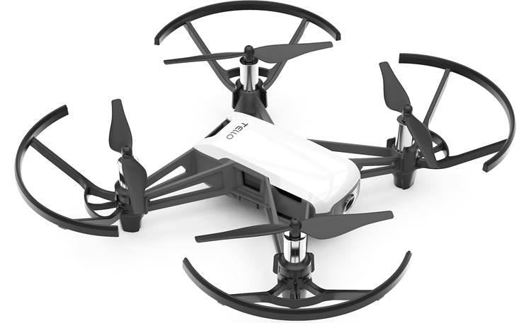

# **用 .NET MAUI 构建 DJI Ryze Tello 无人机应用**

大家好，你有用 .NET MAUI 做应用开发吗？ 通过 .NET 你可以构建多场景的应用，包括传统的桌面应用，云原生应用，移动应用，游戏，机器学习，物联网，大数据等。.NET MAUI 可以让你能通过 C# 快速构建跨平台的应用 ， 一次编码可以构建 iOS / Android / Windows / macOS 的应用。本系列课程结合 DJI Ryze Tello ， 快速搭建一个和无人机交互应用，希望成为你使用 .NET MAUI 的入门教程。

### **将会学到**

1. C# UDP 编程
2. 使用 .NET Poly Notebooks 交互式工具搭建 DJI Ryze Tello 原型
3. 移动应用的相关知识
4. .NET MAUI 跨平台应用的相关知识
5. 使用 .NET MAUI Comet 构建 UI
6. .NET MAUI 绑定移动应用的原生库 

### **应用场景**

无人机是很受欢迎的设备，除了作为航拍用途外，可以直接通过无人机辅助不同行业完成特定的工作，如农业上，如风力发电的设备维护上，还有在 STEM 教育上都有非常大的用途。本次课程基于 DJI Ryze Tello 来完成相关应用的搭建。

**DJI Ryze Tello**

   

DJI Ryze Tello 是一款小型无人机，配备机载摄像头，能够拍摄 5MP 照片和流式传输 720p 高清视频。 它是一款重量轻且价格适中的四轴飞行器，非常适合室内飞行，非常适合新手。 开发人员可以通过 UDP 协议链接到 DJI Ryze Tello ，通过发送不同指令控制 DJI Ryze Tello (起降，花式飞行等) ，并且可以通过UDP 实时图传 DJI Ryze Tello 从摄像头中的影像。

你可以通过 DJI Store 购买  DJI Ryze Tello  https://store.dji.com/shop/tello-series

**相关内容**

本系列希望通过 C# 构建一个 iOS 和 Android 应用控制 DJI Ryze Tello ，并且可以实时获取 DJI Ryze Tello 的图传

你可以按照以下顺序，依次学习相关内容

| 学习主题      | 相关内容 | 进入 |
| ----------- | ----------- | ----------- |
| 开发环境配置      | 开发环境搭建技巧，包括 .NET MAUI 环境的安装 ， 开发工具的配置 ，  以及基于 iOS / Android 应用开发要准备的条件  | 进入  
| C# UDP 编程基础   | 学习 C# UDP 编程 ，以及通过 Notebooks 连接 DJI Ryze Tello ， 完成原型开发的搭建 | 进入 
| .NET MAUI 基础学习    | 学习 .NET MAUI 的相关知识，包括 iOS / Android 开发的相关知识 | 进入 
| .NET MAUI Comet UI 构建应用界面    | 学习 .NET MAUI Comet 的相关知识 ， 使用 .NET MAUI Comet 构建应用界面 | 进入
| .NET MAUI 绑定移动应用的原生库    | 学习把移动应用原生库迁移到 .NET MAUI  | 进入

### **最终达成**

### **Q&A**

如果你有任何问题，可以通过 Email 和我沟通 ，我的 Email 是 kinfeylo@microsoft.com

