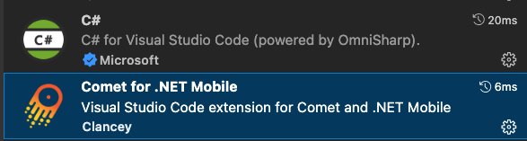
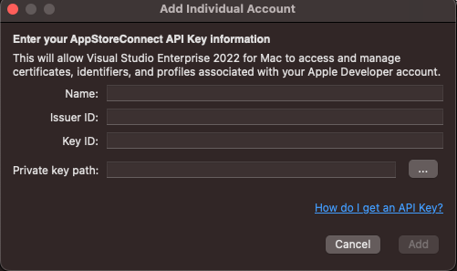

# **开发环境配置**

这是一个非常基础，也是非常重要的内容。

### **.NET SDK**

现在 .NET MAUI 支持 .NET 6 / .NET 7 ,  建议你采用 .NET 7 


### **NET MAUI 环境安装**

你可以通过 Visual Studio 2022 / Visual Studio 2022 安装 .NET MAUI ， 但我个人建议你采用dotnet workload 的方式去安装去更新你的 .NET MAUI 

具体方法 


```bash

dotnet workload install maui

```

还有现在通过 .NET Comet (https://github.com/dotnet/Comet) 开发 .NET MAUI , 还支持 Visual Studio Code 上开发 .NET MAUI (现阶段只对模拟器支持，真机还需要再等等)。这个对于 .NET MAUI 的开发，有很多帮助。毕竟一个轻量级的 IDE 对开发者友好。 本次课程也会涉及到 Visual Studio Code 的开发， 所以大家需要安装好 Comet


```bash

dotnet new -i Clancey.Comet.Templates.Multiplatform

```

还有在 Visual Studio Code 安装好 C# 插件和 .NET Comet 插件



### **机器选择**

.NET MAUI 跨平台开发， 涉及到不同的系统，不同的平台，这个时候你就需要有所选择，现在 Windows 支持 iPhone 模拟器的远程连接和无线调试(需配合 macOS 机器来完成) ， Android 开发 ， 以及 Windows 桌面开发。而 macOS 完善地支持 iOS ， Android 开发，以及 macOS 桌面开发。

从开发工具的角度来说 ， Windows 上有强大的 Visual Studio 2022 ，在编码，调试，发布，测试都有非常完善的功能支持，唯一缺点是 iOS / macOS 的应用场景受限制。对于 Windows 用户而言 ， 可以考虑使用云端机器（ https://www.macincloud.com/ ）来支持远程 iOS，iPadOS 或者 macOS 的调试。

从场景开发的稳定性来说， macOS 在兼容性，稳定性，优势明显，唯一缺点是没有 Windows 开发的支持(当然你可以通过虚拟机或者云端虚拟机方式支持 Windows 开发)

### **更多开发细节**

本系列主要针对 iOS 和 Android 的移动端开发。需要涉及相关知识，包括 UDP，原生库绑定，自定义页面控件知识，这里需要注意

1. UDP 协议在 iOS 上需要在开发者账号上申请，所以你必须要拥有苹果开发者账号

   申请苹果开发者账号地址 https://developer.apple.com/ 

   并且需要做一个 UDP 支持申请 https://developer.apple.com/contact/request/networking-multicast 

   更需要把 App Store Connect API https://developer.apple.com/documentation/appstoreconnectapi/creating_api_keys_for_app_store_connect_api 绑定到你的 Visual Studio 中
   
   


2. 针对机器，更多是在真机上开发，所以你必须有 iPhone 或者 Android 设备

3. .NET MAUI 帮我们解决了从界面到业务逻辑的问题，但你还必须要了解清楚 iOS / Android 的页面特性，和相关设置。如 iOS 的 Info.plist 和 Android 的 AndroidManifest.xml ， 建议开发的时候访问

苹果开发相关内容：https://developer.apple.com/develop/

安卓开发相关内容：https://developer.android.com/docs 

4. 我们需要 Sharpie 工具来做 iOS 原生库的绑定转换，请安装 https://aka.ms/objective-sharpie


