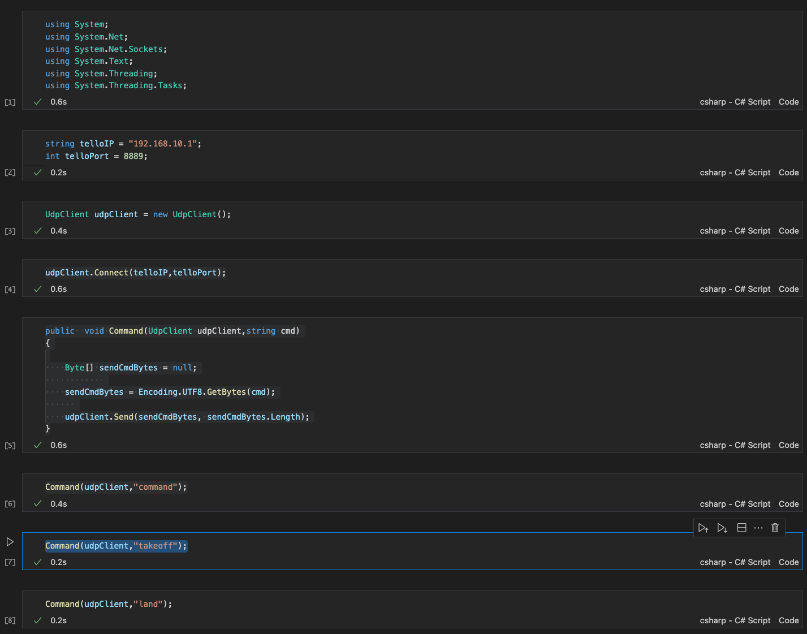
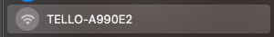

# **C# UDP 编程基础**

首先恭喜你完成了基于本系列的环境搭建，接下来我们进入到应用开发，学习如何用 C# 和 DJI Ryze Tello 进行通信，发送不同的指令。

### **关于 UDP 协议**

根据 DJI Ryze Tello 提供的 SDK 文档，是通过 UDP 连接。 让我们来了解下 UDP 是什么 ？

“UDP（用户数据报协议）是一个与IP 协议一起使用的长期协议，用于在传输速度和效率比安全性和可靠性更重要的场合下发送数据。 UDP 使用一个简单的、具有最小协议机制的无连接通信模型。 UDP 使用校验和保证数据完整性，使用端口号以区分数据发送方和接收方中不同的应用程序。它无需握手会话，即将不可靠的底层网络直接暴露给了用户的应用程序：不保证消息交付、不保证交付顺序也不保证消息不重复。如果需要网络接口层面的纠错功能，则应用程序可以使用为此目的设计的传输控制协议（TCP）或者流控制传输协议（SCTP）。”

在现场实时测控领域，如果有实时、抗干扰性、安全性等要求，都可以采用 UDP 传输数据。我想这也是 DJI Ryze Tello 为何使用 UDP 协议通信的原因。

### **C# 的 UDP 编程**

在 System.Net.Sockets 下你可以通过类 UdpClient 来完成 UDP 协议的相关调用。 这是官方给我们的例子

UdpClient 类提供了在阻塞同步模式下发送和接收无连接 UDP 数据报的简单方法。 因为 UDP 是一种无连接的传输协议，所以在发送和接收数据之前不需要建立远程主机连接。 但是，您确实可以选择通过以下两种方式之一建立默认远程主机：

1. 使用远程主机名和端口号作为参数创建 UdpClient 类的实例

2. 创建 UdpClient 类的实例，然后调用 Connect 方法

您可以使用 UdpClient 中提供的任何发送方法将数据发送到远程设备。 使用 Receive 方法从远程主机接收数据。

### **通过 C# 连接 DJI Ryze Tello**

现在，我们就用 C# 连接我们的 DJI Ryze Tello 。**注意：** 在使用之前，我强烈建议你先阅读 <a href="https://dl-cdn.ryzerobotics.com/downloads/Tello/Tello%20SDK%202.0%20User%20Guide.pdf">DJI Ryze Tello 的文档</a>，这让你熟悉 DJI Ryze Tello 的一切， 有利于你的应用开发。

1. 首先创建一个文件夹，并命名为 TelloNotebook ， 添加一个文件，命名为 sdk_notebook.ipynb ，并用 Visual Studio Code 打开 

备注：这里需要安装好 .NET 的 Polyglot Notebook 插件，如果你没有准备好，请参考开发环境配置文档 

2. Polyglot Notebook 可以让你编写 C# 有交互式的体验



3. 首先引入相关的库

```csharp

using System;
using System.Net;
using System.Net.Sockets;
using System.Text;
using System.Threading;
using System.Threading.Tasks;

```

4. 打开你的 DJI Ryze Tello ，长按开关键，这个时候你可以看到展示灯闪烁，通过设备搜索你的 Wifi 你可以看到相关 Tello 发出的连接，直接连接起来



5. 根据 DJI Ryze Tello 的文档设置接入 192.168.10.1 并设置端口 8889


```csharp

string telloIP = "192.168.10.1";
int telloPort = 8889;

```

6. 通过 C# 的 UdpClient 连接该端口 ，通过 UdpClient 可以和 DJI Ryze Tello 连接上


```csharp

udpClient.Connect(telloIP,telloPort);

```

7. 定义一个执行方法通过 UDP 传输指令给   DJI Ryze Tello , 并执行 command 指令，在正常状态下 DJI Ryze Tello 的指示灯不再闪烁，会变成绿色，这个时候意味着  DJI Ryze Tello 连接准备就绪，等待你发出相关操作指令


```csharp

public  void Command(UdpClient udpClient,string cmd)
{

    Byte[] sendCmdBytes = null;
            
    sendCmdBytes = Encoding.UTF8.GetBytes(cmd);
      
    udpClient.Send(sendCmdBytes, sendCmdBytes.Length);
}

Command(udpClient,"command");


```

8. 根据 SDK 我们可以设置不同的指令，让  DJI Ryze Tello  执行升降 发送 takoff 和 land 的指令， 当然你可以输入更多 


```csharp

Command(udpClient,"takeoff");

Command(udpClient,"land");

```


你现在就可以像  DJI Ryze Tello Python 示例那样通过 Notebook 操控你的  DJI Ryze Tello  了，这也为接下来的 C# 操作封装好 SDK 做了很好的准备。

你可以在 code/TelloNotebook 下直接使用该 notebook 进行运行

## **相关资源**

0. 学习 C#  https://dotnet.microsoft.com/en-us/learn/csharp

1. 了解 C# UDP 编程 https://learn.microsoft.com/en-us/dotnet/api/system.net.sockets.udpclient 

2. DJI Ryze Tello SDK 文档 https://dl-cdn.ryzerobotics.com/downloads/Tello/Tello%20SDK%202.0%20User%20Guide.pdf

3. 使用 Polyglot Notebook 进行 C# 编程 https://devblogs.microsoft.com/dotnet/dotnet-interactive-notebooks-is-now-polyglot-notebooks/


