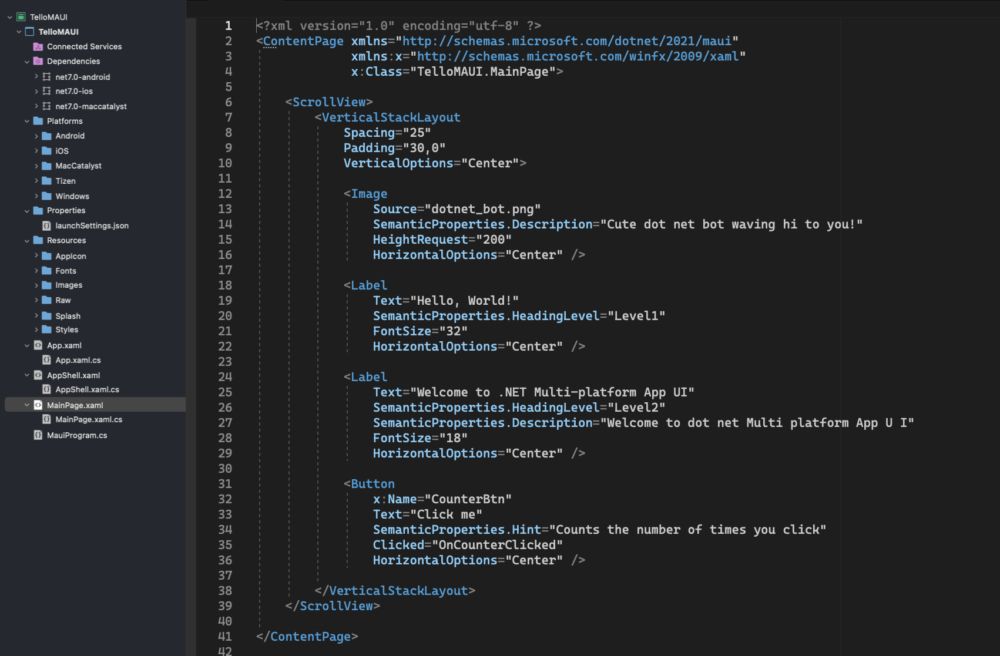
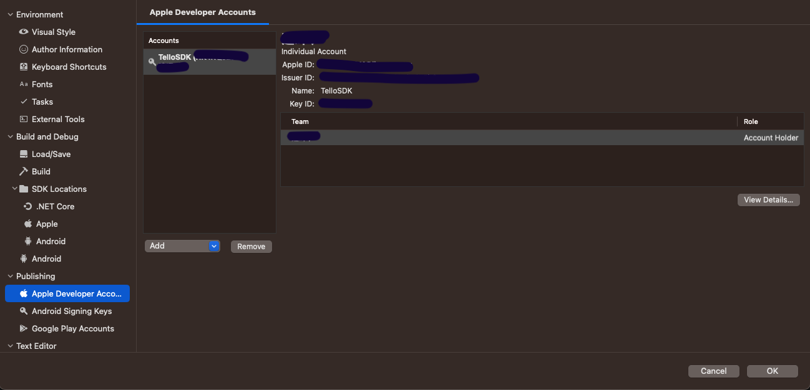
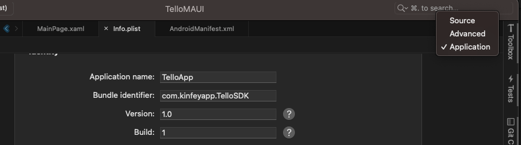
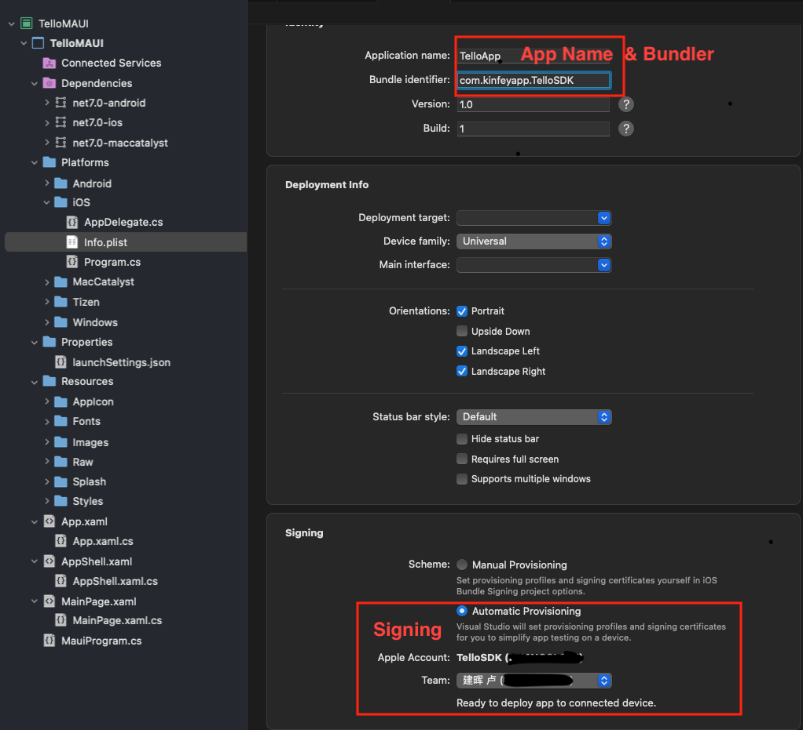
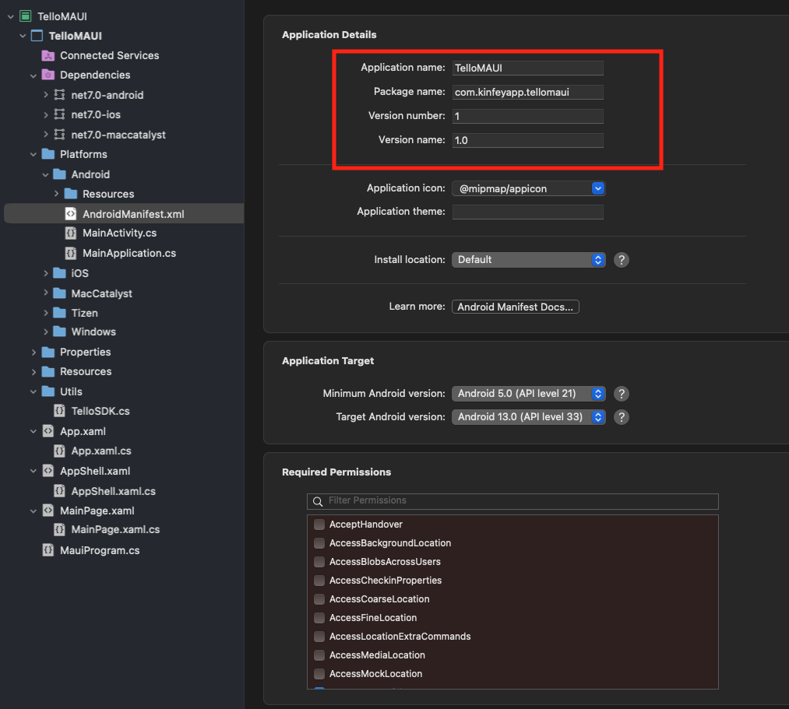

# **.NET MAUI 基础学习**


现在做前端应用需要考虑不同的操作系统，如 Windows , macOS , Linux , Android , iOS , 还需要考虑不同的终端呈现方式，如桌面电脑，Laptop ，手机，平板，还有不同的工业物联网设备。要完成所有的工作，对于开发团队是非常高的要求，对于企业的成本也是非常大的开支。 .NET MAUI 就是解决这个问题的技术，用统一的技术 C# 就可以让你快速构建跨操作平台，跨终端的前端应用。

.NET MAUI 的前身是 Xamarin , 通过整合现在融入到了 .NET SDK 。你可以通过传统的 Visual Studio 或者命令行的方式创建 .NET MAUI 应用。

**Visual Studio 创建 .NET MAUI**

**命令行创建 .NET MAUI**

现在 .NET MAUI 原生支持 Windows ( WinUI ), macOS , Android , iOS 的开发 ， Linux的开发暂不支持。和之前 Xamarin 对比，在项目的结构上做了很大的调整。我归纳了几点：

1. 项目归一，不再分平台划分项目文件

2. UI 构建不单有传统的 XAML ， 现在还有 Blazor UI 构建方式

3. 通过命令行方式的编译，更方便

4. 支持多种 UI 方式的渲染，包括原生 UI ，还有自绘方式的渲染

5. 通过 Handler 自定义控件

## **如何入手 .NET MAUI**

或者你是一个 .NET 开发人员，或者你之前从事过 Windows 桌面的工作，或者你拥有 .NET 的团队，但都有共同的疑问 - 如何无缝进入到 .NET MAUI 领域。这里有几个问题是要注意的

1. 每个平台都有自身的 API ，和特殊的权限设定，你必须要了解清楚，如：
      
    iOS / macOS 的 Info.plist 里面有网络授权，存储授权，以及一些支付授权等系统相关的设定，在使用时就必须设定好 ， 还有应用签名发布都和这个文件相关所以你必须好好阅读 iOS / macOS 的开发者文档 

    Android 的 AndroidManifest.xml 和上面提到的 Info.plist 相近，也关联到 Android 的底层和安全等内容，也涉及到应用发布签名，也必须认真阅读好 Android 的开发者文档


2. 不同平台 UI 构建方式也是非常重要 ，无可否认 .NET MAUI 帮你统一了跨平台的 UI ，但是我们也有自定义界面的时候，所以掌握原生平台的 UI 是非常重要的。

3. 尽量解耦 UI ， 业务逻辑，和底层逻辑 ， 减少不同平台设定的代码在同一个代码里面，尽量回归到 Platform 下的文件做平台调整

4. 要使用一些移动应用的库，就必须要转换，对于 iOS / Android ， .NET MAUI 继续延用了 Xamarin Binding 的方式，但这个过程还是需要有特定平台的支持，我在另一个系列也有提及，大家可以访问这个连接去了解

5. 保持 .NET MAUI 更新 , 因为它可以修复 bug ，和提高运行效率

## **示例 - 用 .NET MAUI 构建一个简单的控制 DJI Ryze Tello 的应用**

在上一篇的学习中我们学习到用 C# 通过 UDP 协议控制  DJI Ryze Tello ， 接下来我们需要把这些功能添加到 iOS / Android 的应用上。接下来我们通过 .NET MAUI 来构建相关的应用。

1. 通过命令行创建 .NET MAUI 项目


```cmd

dotnet new maui -o TelloMAUI

```

2. 用 Visual Studio 2022 打开改项目



3. 因为 iOS 连接 UDP 需要在 Apple 开发者账号设置，也必须添加到 Visual Studio 2022 的项目设定里(具体看开发环境设置)，打开 Perference - Publishing - Apple Developer Account 添加 .p8 文件



打开 Platforms/iOS/Info.plist ，选择 Advance 




添加和证书签名对应的命名空间



并添加

```xml
	  
<key>NSLocationUsageDescription</key>
<string>Using Your Tello Network</string>

```

在 Platforms/iOS 新增 Entitlements.plist


并添加代码


```xml

<?xml version="1.0" encoding="UTF-8"?>
<!DOCTYPE plist PUBLIC "-//Apple//DTD PLIST 1.0//EN" "http://www.apple.com/DTDs/PropertyList-1.0.dtd">
<plist version="1.0">
<dict>
	<key>com.apple.developer.networking.multicast</key>
	<true/>
</dict>
</plist>

```

打开 Platforms/Android/AndroidManifest.xml




4. 添加一个 Utils 文件夹 ，并添加 TelloSDK.cs 文件，添加如下代码 


```csharp

using System.Net;
using System.Net.Sockets;
using System.Text;

namespace TelloMAUI;


public class TelloSDK
{

    string telloIP = "192.168.10.1";
    int port = 8889;
    UdpClient udpClient;

    public TelloSDK()
    {
        this.udpClient = new UdpClient();
    }
    public void Connect()
    {
        this.udpClient.Connect(telloIP, port);
    }

    public void TakeOff()
    {
        Command("takeoff");
    }
    public void Land()
    {
        Command("land");
    }

    public void FlyCMD(string cmd)
    {
        Command(cmd);
    }

    public void Close()
    {
        this.udpClient.Close();
    }

    public void Dispose()
    {
        this.udpClient.Dispose();
    }

    public void Command(string cmd)
    {

        Byte[] sendCmdBytes = null;

        sendCmdBytes = Encoding.UTF8.GetBytes(cmd);

        //this.udpClient.Send(sendCmdBytes, sendCmdBytes.Length);

        var start = DateTime.Now;

        if (cmd != "command" && cmd != "land" && cmd != "streamon")
        {

            bool status = true;

            while (status)
            {
                var current = DateTime.Now;

                if ((current - start).Seconds < 5)
                {

                    status = false;
                    Console.WriteLine("please wait 5 seconds");
                }
                else
                {
                    this.udpClient.Send(sendCmdBytes, sendCmdBytes.Length);
                    status = false;
                }

            }
        }
        else
        {
            this.udpClient.Send(sendCmdBytes, sendCmdBytes.Length);
        }
    }
}


```

5. 修改 MainPage.xaml 


```xml

<?xml version="1.0" encoding="utf-8" ?>
<ContentPage xmlns="http://schemas.microsoft.com/dotnet/2021/maui"
             xmlns:x="http://schemas.microsoft.com/winfx/2009/xaml"
             x:Class="TelloMAUI.MainPage">


    <StackLayout Margin="20">

        <Button Text="TakeOff" x:Name="btnTakeOff" Clicked="btnTakeOff_Clicked" Margin="20,20,20,10"/>

        <Button Text="Land" x:Name="btnLand" Clicked="btnLand_Clicked" Margin="20,20,20,10"/>

        <Button Text="Up" x:Name="btnUp" Clicked="btnUp_Clicked" Margin="20,20,20,10"  />

        <Button Text="Down" x:Name="btnDown" Clicked="btnDown_Clicked" Margin="20,20,20,10"  />

        <Button Text="Left" x:Name="btnLeft" Clicked="btnLeft_Clicked" Margin="20,20,20,10" />

        <Button Text="Right" x:Name="btnRight" Clicked="btnRight_Clicked" Margin="20,20,20,10" />
    
    </StackLayout>

</ContentPage>


```

6. 修改 MainPage.xaml.cs , 新增连接，起飞，降落， 上升，下降，向左，向右的指令


```csharp

namespace TelloMAUI;

public partial class MainPage : ContentPage
{
    TelloSDK tello = new();

    public MainPage()
	{
		InitializeComponent();


        tello.Connect();
        tello.Command("command");
    }


    void btnTakeOff_Clicked(System.Object sender, System.EventArgs e)
    {
        tello.TakeOff();
    }

    void btnLand_Clicked(System.Object sender, System.EventArgs e)
    {

        tello.Land();
    }

    void btnUp_Clicked(System.Object sender, System.EventArgs e)
    {
        tello.FlyCMD("up 30");
    }

    void btnDown_Clicked(System.Object sender, System.EventArgs e)
    {
        tello.FlyCMD("down 30");
    }

    void btnLeft_Clicked(System.Object sender, System.EventArgs e)
    {
        tello.FlyCMD("left 30");
    }

    void btnRight_Clicked(System.Object sender, System.EventArgs e)
    {
        tello.FlyCMD("right 30");
    }
}


```
   
7.  连接真机, 通过真机连接好 Tello 上 的无线网络(具体参考 - <a href="./cn/01.UDPwithCSharp.md">C# UDP 编程基础</a>)，执行


恭喜你成功通过 .NET MAUI 构建了一个简单的无人机应用. 接下来我们会优化这个应用

本章节代码可以从 https://github.com/kinfey/dotNETMauiHOL/tree/main/code/apps/ProtoType/TelloMAUI 下载


## **相关资源**

1. 学习 .NET MAUI https://learn.microsoft.com/en-us/training/paths/build-apps-with-dotnet-maui/

2. iOS / macOS 开发者门户 https://developer.apple.com/ 

3. Android 开发者门户 https://developer.android.com/
