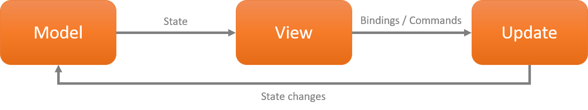

# **.NET MAUI Comet UI 构建应用界面**

在 .NET MAUI 或者 WPF 开发 ， XAML 成为了大家常用的 UI 语言，或者它对开发人员非常友好，可是对于前端开发人员来说就是火星文。 在编写应用界面的时候，对于开发者或者前端人员都会有困扰的感觉，让开发者和前端都能看懂的语言是最好的，而且可以加快开发效率。还有是否寄望写代码的时候，用简短的语言就能描述界面的布局和控件之间的关系呢？而且你更希望界面和我们的业务逻辑尽量解耦。.NET MAUI 的 Comet UI 或者是你最好的帮手。

## **Comet 介绍**

Comet 是一种编写跨平台 UI 的现代方式 ( https://github.com/dotnet/Comet )。 基于 .NET MAUI，它采用 Model - Views - Update (MVU) 模式. 和传统的 XAML 相比 ， 它有几个显著的特点

1. 基于函数式编程
2. Comet 参考了 SwiftUI 和 Flutter 描述界面的方式，更容易去编写页面层次逻辑
3. 用 Comet 开发 .NET MAUI 应用不仅可以在 Visual Studio 上 ，也可以在 Visual Studio Code 上，更简单方便

这是一个用 Comet 描述的实例

```csharp

    View ProfileView() => new HStack
    {
        new Image(()=>"logo.jpeg")
		    .Frame(height: 60, width: 66)
            .ClipShape(new Ellipse()),
        new VStack(LayoutAlignment.Start) {
            new Text(()=> "Reactor Shanghai")
                .FontSize(18)
                .FontWeight(FontWeight.Bold),
            new Text(()=> "Let's learn")
                .FontSize(14),
        }
        .Margin(left: 12),
        new Spacer(),

    }.FitVertical();

```

## **MVU 模式**



MVU 的基本原则是不变性。 除了命令，没有什么能触发边缘效应。 视图是用 C# 或任何“fluent”模式编写的.MVU 的 信息是单向流动。MVU 是美观、干净、清晰，完全适应函数式编程思维方式。

## **函数式编程**

函数式编程的编程语言如 Lisp、Clojure、Erlang、OCaml 和 Haskell，它们已被各种组织用于工业和商业应用程序。函数式编程是使用数学函数进行编程。 这个想法是，只要提供相同的参数，数学函数就会返回相同的结果，并且函数的签名必须传达有关它接受的可能输入和产生的输出的所有信息。

用函数式编程来描述 UI


```csharp

new Button("Ride the Comet! ☄️", ()=>{
	comet.Rides++;
})

```

这是和我们传统不一样的方法 ， 更加简洁，而且对于事件的描述更加清晰


```csharp

Body = () => new VStack {
	new Image(() => video.Cover).Frame(160, 90),
	new Text(() => video.Title),
	new Text(() => video.Author),
	new Text(() => video.Date),
}.Background(Colors.White);

```

## **示例：用 Comet 构造一个  DJI Ryze Tello 的应用**

0. 请安装好 .NET Comet 组件 ，如果你没有安装好，请回到开发环境配置的章节把相关内容配置好

1. 在命令行构建一个 .NET Comet UI 的项目，并用 Visual Studio Code 打开

2. 创建一个 Views 文件夹，一个 Utils 文件夹

3. 设置一个 ControlView.cs , 并添加以下代码

4. 把之前编写好的 TelloSDK.cs 添加进来，放置在 Utils 文件夹

5. 设置按钮，默认是起飞图片 ，当飞机起飞时中间图标就变成降落，当降落后就变回起飞图标

6. 可以通过模拟器看到完整的控件布局

7. 尝试运行


恭喜你，你的 DJI Ryze Tello 应用得到了优化

## **相关资源**


1. 了解 MVU 的内容 https://guide.elm-lang.org/architecture/

2. .NET Comet UI https://github.com/dotnet/Comet


