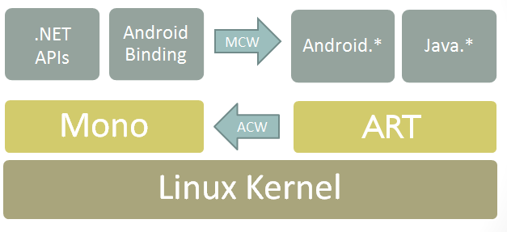

# **.NET MAUI 绑定移动应用的原生库**

一个好的应用需要整合非常多的场景，如支付，电商，地图等，作为开发团队不需要重复造车，直接可以调用不同的 SDK 来完成相关的操作。 .NET MAUI 解决了跨平台应用界面，和绝大多数页面逻辑和业务逻辑的问题。但当我们使用第三方 SDK 时你会发现缺少相关 .NET MAUI 的原生库，只有如支持 iOS / macOS 的 Obj-C / Swfit 的库，以及 Android 开发的 jar / aar 的库。那如何让这些库适配到 .NET MAUI 应用当中呢？


## **iOS / macOS 原生库的绑定**

### **1. 认识动态库和静态库**

最简单理解的方式是在 iOS 中静态库是以 .a 后缀结尾，动态库是以 .dylib 后缀结尾。无论静态库和动态库都可以打包成 Framework 。

静态库和动态库的区别

静态库的特点是编译时会把库文件直接拷贝一份到目标应用程序，而这个拷贝是驻留在目标应用程序里面的，所以编译完成后，静态库的文件就没有用了。但有个缺点就是，因为需要拷贝，所以生成的应用程序的容量会较大

动态库和静态库刚好是相反，编译的时候是不会拷贝到目标应用程序里面的，所以生成应用程序的体积较小，而且一个动态库可以共享给多个应用程序使用。但生成应用程序是依赖于动态库，这也导致经常会出现动态库找不到的情况。

### **2. 通过 Sharpie 工具生成 C# 调用的接口**

Shapie 是一个非常好用的转换工具，它支持在 macOS 下对 Objective-C 的库的转。通过 Sharpie 可以对库文件给出的头文件进行转换完成 C# 的绑定。 在 MAUI 前身 Shapie 工具就已经存在 ， 我经常就利用这个工具做转换。

这里面要注意，你需要安装好 Xcode ，建议安装到最新 ，并对应最新的 iOS SDK , 当然你也可以根据需要绑定不同版本的 iOS SDK , 你可以通过该命令查看环境

```bash

sharpie xcode -sdks

```

### **3. 创建方式**

通过命令行方式创建 iOS 原生库绑定


```bash

dotnet new iosbinding

```


## **Android 原生库 aar/ jar 的绑定**

Android 的库以 .jar 做打包， 通过工具你可以将多个 .jar 完成绑定，然后通过 C# 调用原生的 Java 库。对比起 iOS ， Android 的库绑定简单很多。



从上图可以看到 Xamarin.Android / .NET for Android 通过使用托管可调用包装器 (MCW) 实现绑定。 MCW 是一个 JNI 桥，在托管代码需要调用 Java 代码时会使用它。 托管可调用包装器还支持对 Java 类型进行子类化以及覆盖 Java 类型的虚拟方法。 同样，每当 Android 运行时 (ART) 代码需要调用托管代码时，它都会通过另一个称为 Android 可调用包装器 (ACW) 的 JNI 桥来实现。


通过命令行方式创建 Android 原生库绑定


```bash

dotnet new android-bindinglib

```

