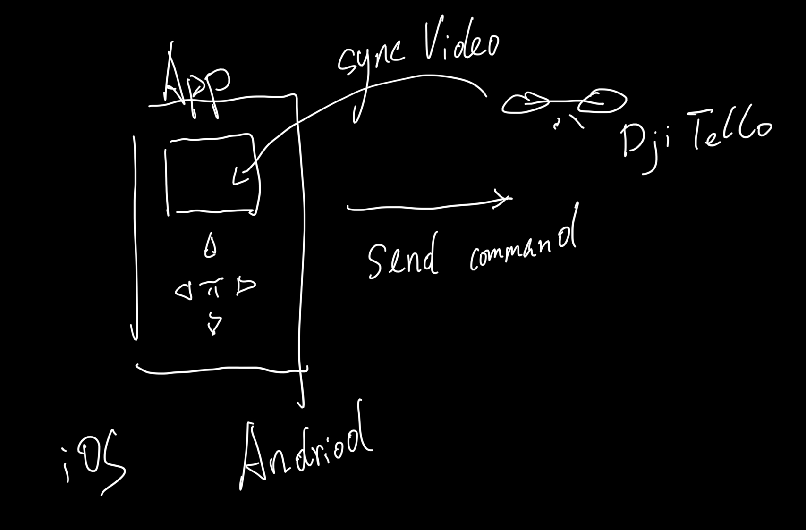
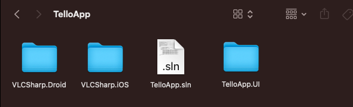
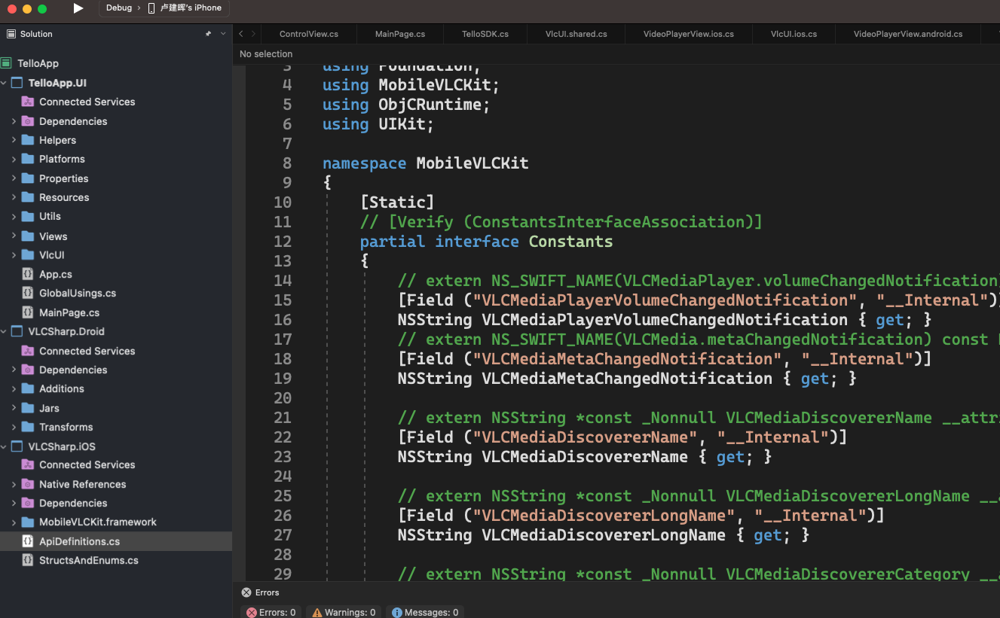

# **.NET MAUI 构建一个完整的项目技巧**



看上面的需求，我们需要做一个 iOS / Android App 控制 DJI Ryze Tello ， 从之前的章节，我们已经把界面，原生库，和 UDP 通讯协议都已经解决了，现在我们需要把之前做的步骤归总到一个项目中。

1. 创建一个 TelloApp 文件夹

2. 在命令行输入


```cmd

dotnet new sln

```

3. 把之前的绑定文件，和创建好的 UI 统一放到 TelloApp 文件夹



4. 用 Visual Studio 2022 打开刚创建的 sln 文件，并把 TelloApp.UI , VLCSharp.iOS , VLCSharp.Droid 



5. 我们需要对 TelloApp.UI 的 csproj 项目文件进行调整，如下图：


```xml

<Project Sdk="Microsoft.NET.Sdk">

	<PropertyGroup>
		<TargetFrameworks>net7.0-android;net7.0-ios</TargetFrameworks>
		<OutputType>Exe</OutputType>
		<RootNamespace>TelloApp.UI</RootNamespace>
		<UseMaui>true</UseMaui>
		<SingleProject>true</SingleProject>
		<ImplicitUsings>disable</ImplicitUsings>

		<!-- Display name -->
		<ApplicationTitle>Tello.Apps</ApplicationTitle>

		<!-- App Identifier -->
		<ApplicationId>com.kinfeyapp.TelloApps</ApplicationId>

		<!-- Versions -->
		<ApplicationDisplayVersion>1.0</ApplicationDisplayVersion>
		<ApplicationVersion>1</ApplicationVersion>

		<SupportedOSPlatformVersion Condition="$([MSBuild]::GetTargetPlatformIdentifier('$(TargetFramework)')) == 'ios'">14.2</SupportedOSPlatformVersion>
		<SupportedOSPlatformVersion Condition="$([MSBuild]::GetTargetPlatformIdentifier('$(TargetFramework)')) == 'android'">21.0</SupportedOSPlatformVersion>
	</PropertyGroup>

	<PropertyGroup Condition="'$(Configuration)|$(TargetFramework)|$(Platform)'=='Debug|net7.0-ios|AnyCPU'">
	  <CreatePackage>false</CreatePackage>
	</PropertyGroup>
	<ItemGroup>
		<!-- App Icon -->
		<MauiIcon Include="Resources\appicon.svg" ForegroundFile="Resources\appiconfg.svg" Color="#512BD4" />

		<!-- Splash Screen -->
		<MauiSplashScreen Include="Resources\appiconfg.svg" Color="#512BD4" BaseSize="128,128" />

		<!-- Images -->
		<MauiImage Include="Resources\Images\*" />
		<MauiFont Include="Resources\Fonts\*" />

		<!-- Raw Assets (also remove the "Resources\Raw" prefix) -->
		<MauiAsset Include="Resources\Raw\**" LogicalName="%(RecursiveDir)%(Filename)%(Extension)" />
	</ItemGroup>

	<ItemGroup>
		<PackageReference Include="Clancey.Comet" Version="0.3.466-beta" />
		<PackageReference Include="Reloadify3000" Version="1.0.8" />
	</ItemGroup>

  
	<PropertyGroup Condition="$(TargetFramework.Contains('-ios'))">
        <RuntimeIdentifier>ios-arm64</RuntimeIdentifier>
        <UseMSBuildEngine>true</UseMSBuildEngine>
        <WarningLevel>4</WarningLevel>
        <MtouchLink>SdkOnly</MtouchLink>
        <SupportedOSPlatformVersion>14.2</SupportedOSPlatformVersion>
        <DeviceSpecificBuild>true</DeviceSpecificBuild>
        <MtouchDebug>true</MtouchDebug>
        <MtouchFastDev>true</MtouchFastDev>
        <MtouchProfiling>true</MtouchProfiling>
        <MtouchUseSGen>true</MtouchUseSGen>
        <MtouchUseRefCounting>true</MtouchUseRefCounting>
        <MtouchFloat32>true</MtouchFloat32>
    </PropertyGroup> 

	
	<PropertyGroup Condition="'$(Configuration)|$(TargetFramework)|$(Platform)'=='Release|net7.0-ios|AnyCPU'">
	  <CreatePackage>false</CreatePackage>
	</PropertyGroup>
  <ItemGroup Condition="'$(TargetPlatformIdentifier)' == 'ios'">
    <Compile Include="VlcUI\*.ios.cs" Exclude="$(DefaultItemExcludes);$(DefaultExcludesInProjectFolder)" />
    <Compile Include="VlcUI\*.ios.*.cs" Exclude="$(DefaultItemExcludes);$(DefaultExcludesInProjectFolder)" />
  </ItemGroup>

  <ItemGroup Condition="'$(TargetPlatformIdentifier)' == 'android'">
    <Compile Include="VlcUI\*.android.cs" Exclude="$(DefaultItemExcludes);$(DefaultExcludesInProjectFolder)" />
    <Compile Include="VlcUI\*.android.*.cs" Exclude="$(DefaultItemExcludes);$(DefaultExcludesInProjectFolder)" />
  </ItemGroup>

    <ItemGroup Condition=" '$(TargetPlatformIdentifier)' == 'ios' ">
    	<ProjectReference Include="..\VLCSharp.iOS\VLCSharp.iOS.csproj" /> 
    </ItemGroup>
  
	<ItemGroup Condition=" '$(TargetPlatformIdentifier)' == 'android' ">
		<ProjectReference Include="..\VLCSharp.Droid\VLCSharp.Droid.csproj" /> 
	</ItemGroup>

	<ItemGroup>
	  <Folder Include="Utils\" />
	  <Folder Include="Views\" />
	  <Folder Include="VlcUI\" />
	</ItemGroup>
	<ItemGroup>
	  <None Remove="Resources\Images\down.png" />
	  <None Remove="Resources\Images\fly_land.png" />
	  <None Remove="Resources\Images\fly_takeoff.png" />
	  <None Remove="Resources\Images\left.png" />
	  <None Remove="Resources\Images\right.png" />
	  <None Remove="Resources\Images\up.png" />
	</ItemGroup>
	<ItemGroup>
	  <BundleResource Include="Resources\Images\down.png" />
	  <BundleResource Include="Resources\Images\fly_land.png" />
	  <BundleResource Include="Resources\Images\fly_takeoff.png" />
	  <BundleResource Include="Resources\Images\left.png" />
	  <BundleResource Include="Resources\Images\right.png" />
	  <BundleResource Include="Resources\Images\up.png" />
	</ItemGroup>
</Project>


```

我们需要做的调整包括：

 只针对 iOS / Android 进行编译

```xml

<TargetFrameworks>net7.0-android;net7.0-ios</TargetFrameworks>

```

 针对 iOS ， Android 引入不同的原生库


```xml

    <ItemGroup Condition=" '$(TargetPlatformIdentifier)' == 'ios' ">
    	<ProjectReference Include="..\VLCSharp.iOS\VLCSharp.iOS.csproj" /> 
    </ItemGroup>
	<ItemGroup Condition=" '$(TargetPlatformIdentifier)' == 'android' ">
		<ProjectReference Include="..\VLCSharp.Droid\VLCSharp.Droid.csproj" /> 
	</ItemGroup>

```

 针对不同平台的页面进行编译


```xml


  <ItemGroup Condition="'$(TargetPlatformIdentifier)' == 'ios'">
    <Compile Include="VlcUI\*.ios.cs" Exclude="$(DefaultItemExcludes);$(DefaultExcludesInProjectFolder)" />
    <Compile Include="VlcUI\*.ios.*.cs" Exclude="$(DefaultItemExcludes);$(DefaultExcludesInProjectFolder)" />
  </ItemGroup>

  <ItemGroup Condition="'$(TargetPlatformIdentifier)' == 'android'">
    <Compile Include="VlcUI\*.android.cs" Exclude="$(DefaultItemExcludes);$(DefaultExcludesInProjectFolder)" />
    <Compile Include="VlcUI\*.android.*.cs" Exclude="$(DefaultItemExcludes);$(DefaultExcludesInProjectFolder)" />
  </ItemGroup>

```

6. 关于自定义 UI，因为我们通过 LibVLC 库实现图传，所以我们除了绑定外还需要定义 UI ，这个就是我们所说的 CustomHandler 的方法

如果你希望了解更多，可以参看这里 https://github.com/kinfey/AMapMAUIControls/blob/main/tutorial/cn/03.UIControls.md


这个时候你就可以完整编译所有的内容，并部署到真机，恭喜你，你成功用 .NET MAUI 搭建了一个简单的 DJI Ryze Tello 应用


感谢

## **相关资源**

1. 自定义 UI https://learn.microsoft.com/en-us/dotnet/maui/user-interface/handlers/create