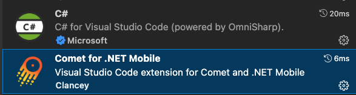
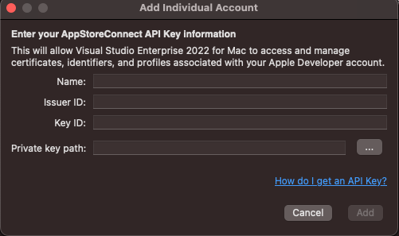

# **Development environment configuration**

This is a very basic and very important content.

### **.NET SDK**

Now .NET MAUI supports .NET 6 / .NET 7, it is recommended that you use .NET 7


### **NET MAUI installation**

You can install .NET MAUI through Visual Studio 2022 / Visual Studio 2022, but I personally recommend that you use dotnet workload to install and update your .NET MAUI in terminal

```bash

dotnet workload install maui

```

Also, .NET MAUI is now developed through .NET Comet (https://github.com/dotnet/Comet), and it also supports the development of .NET MAUI on Visual Studio Code (at this stage, it is only supported for emulators, and the real device still needs to wait Wait). This is very helpful for the development of .NET MAUI. After all, a lightweight IDE is developer-friendly. This series will also involve the development of Visual Studio Code, so you need to install Comet


```bash

dotnet new -i Clancey.Comet.Templates.Multiplatform

```

Also install the C# extension and the .NET Comet extension in Visual Studio Code



### **Devices**

.NET MAUI cross-platform development involves different systems and platforms. At this time, you need to make a choice. Now Windows supports remote connection and wireless debugging of the iPhone simulator (need to be completed with macOS machines), Android development, and Windows desktop development. And macOS fully supports iOS, Android development, and macOS desktop development.

From the perspective of development tools, there is powerful Visual Studio 2022 on Windows, which has very complete functional support in coding, debugging, publishing, and testing. The only disadvantage is that the application scenarios of iOS/macOS are limited. For Windows users, you can consider using a cloud machine (https://www.macincloud.com/) to support remote iOS, iPadOS or macOS debugging.

From the perspective of scene development stability, macOS has obvious advantages in compatibility, stability, and the only disadvantage is that there is no support for Windows development (of course, you can support Windows development through virtual machines or cloud virtual machines)

### **More Details**

This series focuses on mobile development for iOS and Android. Relevant knowledge is required, including UDP, native library binding, and custom page control knowledge, here you need to pay attention

1. The UDP protocol needs to be applied on the developer account on iOS, so you must have an Apple developer account

    Apply for an Apple developer account address https://developer.apple.com/

    And need to make a request for UDP support https://developer.apple.com/contact/request/networking-multicast

    You also need to bind the App Store Connect API https://developer.apple.com/documentation/appstoreconnectapi/creating_api_keys_for_app_store_connect_api to your Visual Studio
   
    


2. For the device, it is more developed on the real devices, so you must have an iPhone or Android device

3. .NET MAUI helps us solve the problems from the interface to the business logic, but you must also understand the page features and related settings of iOS / Android clearly. Such as iOS's Info.plist and Android's AndroidManifest.xml, it is recommended to visit when developing

Apple development content: https://developer.apple.com/develop/

Android development content: https://developer.android.com/docs

4. We need Sharpie tool to do binding conversion of iOS native library, please install https://aka.ms/objective-sharpie
