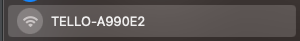

# **C# UDP Programming**

First of all, congratulations on completing the environment construction based on this series. Next, we will enter the application development and learn how to use C# to communicate with DJI Ryze Tello and send different commands.

### **UDP protocol**

According to the SDK documentation provided by DJI Ryze Tello, the connection is via UDP. Let's find out what is UDP?

"UDP (User Datagram Protocol) is a long-term protocol used with the IP protocol to send data where transmission speed and efficiency are more important than security and reliability. UDP uses a simple, minimal protocol mechanism A connectionless communication model. UDP uses checksums to ensure data integrity, and uses port numbers to distinguish different applications in the data sender and receiver. It does not require a handshake session, which directly exposes the unreliable underlying network to the user's Application: No guarantee of message delivery, no guarantee of delivery order, and no guarantee of non-duplication of messages. If error correction at the network interface level is required, the application can use the Transmission Control Protocol (TCP) or Stream Control Transmission Protocol designed for this purpose (SCTP)."

In the field of on-site real-time measurement and control, if there are requirements for real-time, anti-interference, security, etc., UDP can be used to transmit data. I think this is why DJI Ryze Tello uses UDP protocol for communication.

### **UDP Programming in C#**

Under System.Net.Sockets, you can use the UdpClient class to complete the related calls of the UDP protocol. This is the example given to us by the official

The UdpClient class provides simple methods for sending and receiving connectionless UDP datagrams in blocking synchronous mode. Because UDP is a connectionless transport protocol, there is no need to establish a remote host connection before sending and receiving data. However, you do have the option of establishing a default remote host in one of two ways:

1. Create an instance of the UdpClient class using the remote hostname and port number as parameters

2. Create an instance of the UdpClient class and call the Connect method

You can send data to a remote device using any of the send methods available in UdpClient. Use the Receive method to receive data from a remote host.

### **Connect to DJI Ryze Tello via C#**

Now, let's connect our DJI Ryze Tello with C#. **Note:** Before using, I strongly recommend you to read <a href="https://dl-cdn.ryzerobotics.com/downloads/Tello/Tello%20SDK%202.0%20User%20Guide.pdf"> Documentation of DJI Ryze Tello</a>, which makes you familiar with everything about DJI Ryze Tello, which is beneficial to your application development.

1. First create a folder and name it TelloNotebook, add a file, name it sdk_notebook.ipynb, and open it with Visual Studio Code

Remarks: The Polyglot Notebook plug-in for .NET needs to be installed here. If you are not ready, please refer to the development environment configuration document

2. Polyglot Notebook allows you to write C# with an interactive experience


3. Import some library

```csharp

using System;
using System.Net;
using System.Net.Sockets;
using System.Text;
using System.Threading;
using System.Threading.Tasks;

```

4. Turn on your DJI Ryze Tello, long press the power button, at this time you can see the display light flashing, search your Wifi through the device, you can see the connection sent by the relevant Tello, connect directly



5. According to the documentation of DJI Ryze Tello, set up access to 192.168.10.1 and set port 8889


```csharp

string telloIP = "192.168.10.1";
int telloPort = 8889;

```

6. Connect to this port through C#’s UdpClient, and you can connect to DJI Ryze Tello through UdpClient


```csharp

udpClient.Connect(telloIP,telloPort);

```

7. Define an execution method to transmit commands to DJI Ryze Tello through UDP, and execute the command . In the normal state, the indicator light of DJI Ryze Tello will no longer blink and will turn green. This means that the DJI Ryze Tello connection is ready and waiting for you Issue relevant operation instructions


```csharp

public  void Command(UdpClient udpClient,string cmd)
{

    Byte[] sendCmdBytes = null;
            
    sendCmdBytes = Encoding.UTF8.GetBytes(cmd);
      
    udpClient.Send(sendCmdBytes, sendCmdBytes.Length);
}

Command(udpClient,"command");


```

8. According to the SDK, we can set different commands to let DJI Ryze Tello perform lifting and send takoff and land commands, of course you can enter more


```csharp

Command(udpClient,"takeoff");

Command(udpClient,"land");

```


You can now control your DJI Ryze Tello through Notebook like the DJI Ryze Tello Python example, which is also a good preparation for the next C# operation to package the SDK.

You can directly use this notebook to run it under code/TelloNotebook

## **Resources**

0. Learn C#  https://dotnet.microsoft.com/en-us/learn/csharp

1. C# UDP Programming https://learn.microsoft.com/en-us/dotnet/api/system.net.sockets.udpclient 

2. DJI Ryze Tello SDK Docs https://dl-cdn.ryzerobotics.com/downloads/Tello/Tello%20SDK%202.0%20User%20Guide.pdf

3. Using Polyglot Notebook with C# https://devblogs.microsoft.com/dotnet/dotnet-interactive-notebooks-is-now-polyglot-notebooks/