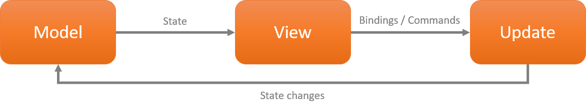

# **Using .NET Comet  to build .NET MAUI UI**

In .NET MAUI or WPF development, XAML has become a commonly used UI language, or it is very friendly to developers, but it is Martian language for front-end developers. When writing an application interface, developers or front-end personnel will feel troubled. A language that both developers and front-end can understand is the best, and it can speed up development efficiency. Also, do you hope that when writing code, you can describe the layout of the interface and the relationship between controls in a short language? And you prefer to decouple the interface from our business logic as much as possible. .NET MAUI's Comet UI may be your best helper.

## **What's Comet**

Comet is a modern way to write cross-platform UI (https://github.com/dotnet/Comet). Based on .NET MAUI, it adopts Model - Views - Update (MVU) pattern. Compared with traditional XAML, it has several notable features

1. Based on functional programming
2. Comet refers to the way SwiftUI and Flutter describe the interface, making it easier to write page-level logic
3. Use Comet to develop .NET MAUI applications not only on Visual Studio, but also on Visual Studio Code, which is easier and more convenient

Here is sample UI with Comet


```csharp

    View ProfileView() => new HStack
    {
        new Image(()=>"logo.jpeg")
		    .Frame(height: 60, width: 66)
            .ClipShape(new Ellipse()),
        new VStack(LayoutAlignment.Start) {
            new Text(()=> "Reactor Shanghai")
                .FontSize(18)
                .FontWeight(FontWeight.Bold),
            new Text(()=> "Let's learn")
                .FontSize(14),
        }
        .Margin(left: 12),
        new Spacer(),

    }.FitVertical();

```

## **MVU**



A fundamental principle of MVU is immutability. Nothing triggers edge effects except commands. Views are written in C# or any "fluent" pattern. MVU's information flows in one direction. MVU is beautiful, clean, and clear, and fits perfectly with the functional programming.

## **Functional Programming**

Functional programming languages such as Lisp, Clojure, Erlang, OCaml, and Haskell have been used by various organizations for industrial and commercial applications. Functional programming is programming using mathematical functions. The idea is that mathematical functions return the same results as long as they are given the same arguments, and the function's signature must convey all the information about the possible inputs it accepts and the outputs it produces.

Describe UI with functional programming


```csharp

new Button("Ride the Comet! ☄️", ()=>{
	comet.Rides++;
})

```

This is a different method from our coding, it is more concise, and the description of the event is clearer


```csharp

Body = () => new VStack {
	new Image(() => video.Cover).Frame(160, 90),
	new Text(() => video.Title),
	new Text(() => video.Author),
	new Text(() => video.Date),
}.Background(Colors.White);

```

## **Sample: Construct a DJI Ryze Tello application with Comet**

0. Please install the .NET Comet component. If you have not installed it, please go back to the chapter of development environment configuration to configure the relevant content.

1. Build a .NET Comet UI project on the command line and open it with Visual Studio Code

```bash

dotnet new comet -n TelloCometUI

```

2. Create a Views folder, a Utils folder

3. Add the previously written TelloSDK.cs and place it in the Utils folder

4. Set up a ControlView.cs and add the following code


```csharp

namespace TelloCometUI;


public class ControlView : View{

    readonly TelloSDK tello = new();

	[State]
	readonly TelloStatus telloStatus = new();

    public ControlView()
    {
        tello.Connect();
        tello.Command("command");
    }


    [Body]
    View body()
        => new HStack {
           new Grid{
            new VStack(){
                new HStack(){
                    new ImageButton("up.png" ,()=>{
                        tello.FlyCMD("up 20");
                    }).Frame(width:50,height:50).Alignment(Alignment.Center),
                },
                new HStack(){
                    new ImageButton("left.png" ,()=>{
                        tello.FlyCMD("left 20");
                    }).Frame(width:50,height:50).Alignment(Alignment.Leading),
                    new ImageButton(telloStatus.DroneStatus ,()=>{
                        if(telloStatus.TakeOff){
                           tello.TakeOff();
                        }
                        else
                        {
                           tello.Land();
                        }
                        telloStatus.TakeOff = !telloStatus.TakeOff;
                    }).Frame(width:80,height:80).Alignment(Alignment.Center),
                    new ImageButton("right.png" ,()=>{
                            tello.FlyCMD("right 20");
                    }).Frame(width:50,height:50).Alignment(Alignment.Trailing),
                },
                new HStack(){
                    new ImageButton("down.png" ,()=>{
                            tello.FlyCMD("down 20");
                    }).Frame(width:50,height:50).Alignment(Alignment.Center),
                },
            }.Padding(20).Margin(30).Alignment(Alignment.Center),
          } 
        }.Background(Color.FromRgb(82, 45, 210)).Alignment(Alignment.Center);

    
	public class TelloStatus : BindingObject
	{
        public TelloStatus()
        {
            TakeOff = true;
        }   
		public bool TakeOff
		{
			get => GetProperty<bool>();
			set => SetProperty(value);
		}

		public string DroneStatus
		{
			get
			{
				return TakeOff ? "fly_takeoff.png" : "fly_land.png";
			}
            set => SetProperty(value);
		}

	}

}

```

5. Adjust App.cs to change the MainPage view to ControllView


```csharp

[Body]
View view() => new ControlView();

```

   You can try to run the emulator under VS Code to view related content

6. Try to run it on a real device. Note: At this stage, Visual Studio Code does not support running on a real machine, so please use Visual Studio to open the project and run it.


Congratulations, your DJI Ryze Tello app has been optimized

## **Resources**


1. Learn MVU https://guide.elm-lang.org/architecture/

2. Learn .NET Comet  https://github.com/dotnet/Comet