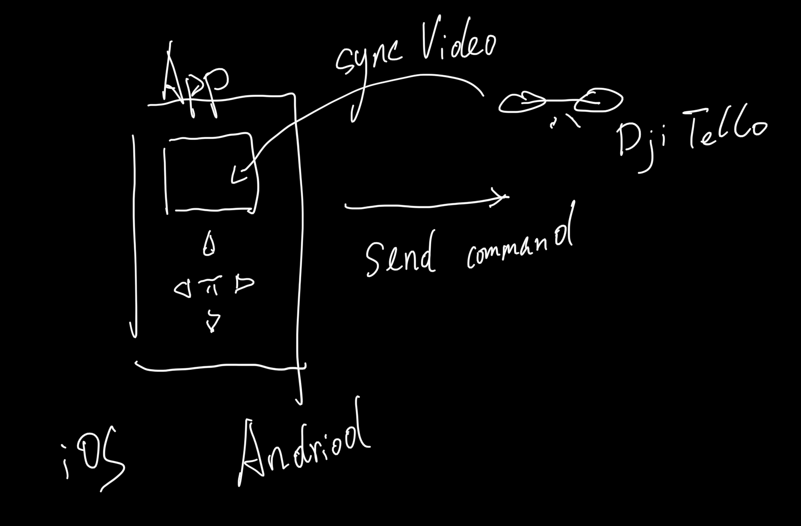
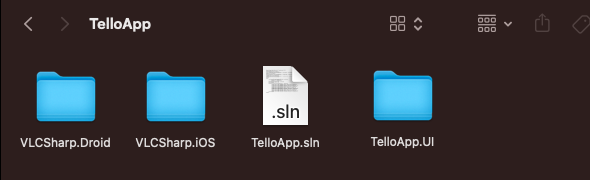
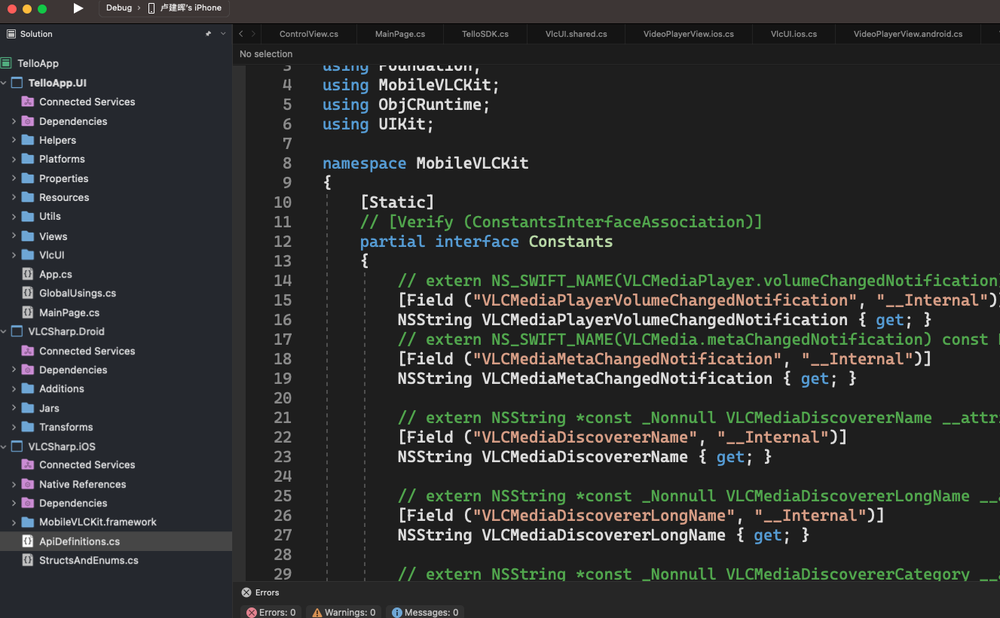

# **Build DJI Ryze Tello Drone Application with .NET MAUI**



Looking at the above requirements, we need to make an iOS / Android App to control DJI Ryze Tello. From the previous chapters, we have solved the interface, native library, and UDP communication protocol. Now we need to summarize the steps we did before into a project.

1. Create a TelloApp folder

2. In the command line


```cmd

dotnet new sln

```

3. Put the previous binding file and the created UI into the TelloApp folder



4. Open the newly created sln file with Visual Studio 2022, and put TelloApp.UI , VLCSharp.iOS , VLCSharp.Droid



5. We need to adjust the csproj project file of TelloApp.UI, as shown below:


```xml

<Project Sdk="Microsoft.NET.Sdk">

	<PropertyGroup>
		<TargetFrameworks>net7.0-android;net7.0-ios</TargetFrameworks>
		<OutputType>Exe</OutputType>
		<RootNamespace>TelloApp.UI</RootNamespace>
		<UseMaui>true</UseMaui>
		<SingleProject>true</SingleProject>
		<ImplicitUsings>disable</ImplicitUsings>

		<!-- Display name -->
		<ApplicationTitle>Tello.Apps</ApplicationTitle>

		<!-- App Identifier -->
		<ApplicationId>com.kinfeyapp.TelloApps</ApplicationId>

		<!-- Versions -->
		<ApplicationDisplayVersion>1.0</ApplicationDisplayVersion>
		<ApplicationVersion>1</ApplicationVersion>

		<SupportedOSPlatformVersion Condition="$([MSBuild]::GetTargetPlatformIdentifier('$(TargetFramework)')) == 'ios'">14.2</SupportedOSPlatformVersion>
		<SupportedOSPlatformVersion Condition="$([MSBuild]::GetTargetPlatformIdentifier('$(TargetFramework)')) == 'android'">21.0</SupportedOSPlatformVersion>
	</PropertyGroup>

	<PropertyGroup Condition="'$(Configuration)|$(TargetFramework)|$(Platform)'=='Debug|net7.0-ios|AnyCPU'">
	  <CreatePackage>false</CreatePackage>
	</PropertyGroup>
	<ItemGroup>
		<!-- App Icon -->
		<MauiIcon Include="Resources\appicon.svg" ForegroundFile="Resources\appiconfg.svg" Color="#512BD4" />

		<!-- Splash Screen -->
		<MauiSplashScreen Include="Resources\appiconfg.svg" Color="#512BD4" BaseSize="128,128" />

		<!-- Images -->
		<MauiImage Include="Resources\Images\*" />
		<MauiFont Include="Resources\Fonts\*" />

		<!-- Raw Assets (also remove the "Resources\Raw" prefix) -->
		<MauiAsset Include="Resources\Raw\**" LogicalName="%(RecursiveDir)%(Filename)%(Extension)" />
	</ItemGroup>

	<ItemGroup>
		<PackageReference Include="Clancey.Comet" Version="0.3.466-beta" />
		<PackageReference Include="Reloadify3000" Version="1.0.8" />
	</ItemGroup>

  
	<PropertyGroup Condition="$(TargetFramework.Contains('-ios'))">
        <RuntimeIdentifier>ios-arm64</RuntimeIdentifier>
        <UseMSBuildEngine>true</UseMSBuildEngine>
        <WarningLevel>4</WarningLevel>
        <MtouchLink>SdkOnly</MtouchLink>
        <SupportedOSPlatformVersion>14.2</SupportedOSPlatformVersion>
        <DeviceSpecificBuild>true</DeviceSpecificBuild>
        <MtouchDebug>true</MtouchDebug>
        <MtouchFastDev>true</MtouchFastDev>
        <MtouchProfiling>true</MtouchProfiling>
        <MtouchUseSGen>true</MtouchUseSGen>
        <MtouchUseRefCounting>true</MtouchUseRefCounting>
        <MtouchFloat32>true</MtouchFloat32>
    </PropertyGroup> 

	
	<PropertyGroup Condition="'$(Configuration)|$(TargetFramework)|$(Platform)'=='Release|net7.0-ios|AnyCPU'">
	  <CreatePackage>false</CreatePackage>
	</PropertyGroup>
  <ItemGroup Condition="'$(TargetPlatformIdentifier)' == 'ios'">
    <Compile Include="VlcUI\*.ios.cs" Exclude="$(DefaultItemExcludes);$(DefaultExcludesInProjectFolder)" />
    <Compile Include="VlcUI\*.ios.*.cs" Exclude="$(DefaultItemExcludes);$(DefaultExcludesInProjectFolder)" />
  </ItemGroup>

  <ItemGroup Condition="'$(TargetPlatformIdentifier)' == 'android'">
    <Compile Include="VlcUI\*.android.cs" Exclude="$(DefaultItemExcludes);$(DefaultExcludesInProjectFolder)" />
    <Compile Include="VlcUI\*.android.*.cs" Exclude="$(DefaultItemExcludes);$(DefaultExcludesInProjectFolder)" />
  </ItemGroup>

    <ItemGroup Condition=" '$(TargetPlatformIdentifier)' == 'ios' ">
    	<ProjectReference Include="..\VLCSharp.iOS\VLCSharp.iOS.csproj" /> 
    </ItemGroup>
  
	<ItemGroup Condition=" '$(TargetPlatformIdentifier)' == 'android' ">
		<ProjectReference Include="..\VLCSharp.Droid\VLCSharp.Droid.csproj" /> 
	</ItemGroup>

	<ItemGroup>
	  <Folder Include="Utils\" />
	  <Folder Include="Views\" />
	  <Folder Include="VlcUI\" />
	</ItemGroup>
	<ItemGroup>
	  <None Remove="Resources\Images\down.png" />
	  <None Remove="Resources\Images\fly_land.png" />
	  <None Remove="Resources\Images\fly_takeoff.png" />
	  <None Remove="Resources\Images\left.png" />
	  <None Remove="Resources\Images\right.png" />
	  <None Remove="Resources\Images\up.png" />
	</ItemGroup>
	<ItemGroup>
	  <BundleResource Include="Resources\Images\down.png" />
	  <BundleResource Include="Resources\Images\fly_land.png" />
	  <BundleResource Include="Resources\Images\fly_takeoff.png" />
	  <BundleResource Include="Resources\Images\left.png" />
	  <BundleResource Include="Resources\Images\right.png" />
	  <BundleResource Include="Resources\Images\up.png" />
	</ItemGroup>
</Project>


```

The adjustments we need to make include:

 Only compile for iOS / Android

```xml

<TargetFrameworks>net7.0-android;net7.0-ios</TargetFrameworks>

```

 For iOS, Android references different native libraries


```xml

    <ItemGroup Condition=" '$(TargetPlatformIdentifier)' == 'ios' ">
    	<ProjectReference Include="..\VLCSharp.iOS\VLCSharp.iOS.csproj" /> 
    </ItemGroup>
	<ItemGroup Condition=" '$(TargetPlatformIdentifier)' == 'android' ">
		<ProjectReference Include="..\VLCSharp.Droid\VLCSharp.Droid.csproj" /> 
	</ItemGroup>

```

Compile pages for different platforms


```xml


  <ItemGroup Condition="'$(TargetPlatformIdentifier)' == 'ios'">
    <Compile Include="VlcUI\*.ios.cs" Exclude="$(DefaultItemExcludes);$(DefaultExcludesInProjectFolder)" />
    <Compile Include="VlcUI\*.ios.*.cs" Exclude="$(DefaultItemExcludes);$(DefaultExcludesInProjectFolder)" />
  </ItemGroup>

  <ItemGroup Condition="'$(TargetPlatformIdentifier)' == 'android'">
    <Compile Include="VlcUI\*.android.cs" Exclude="$(DefaultItemExcludes);$(DefaultExcludesInProjectFolder)" />
    <Compile Include="VlcUI\*.android.*.cs" Exclude="$(DefaultItemExcludes);$(DefaultExcludesInProjectFolder)" />
  </ItemGroup>

```

6. Regarding the custom UI, because we implement image transmission through the LibVLC library, we need to define the UI in addition to the binding. This is what we call the CustomHandler method

If you want to know more, you can refer to https://github.com/kinfey/AMapMAUIControls/blob/main/tutorial/en/03.UIControls.md


At this point, you can fully compile all the content and deploy it to the real device. Congratulations, you have successfully built a simple DJI Ryze Tello application with .NET MAUI


## **Resources**

1. Custom UI https://learn.microsoft.com/en-us/dotnet/maui/user-interface/handlers/create